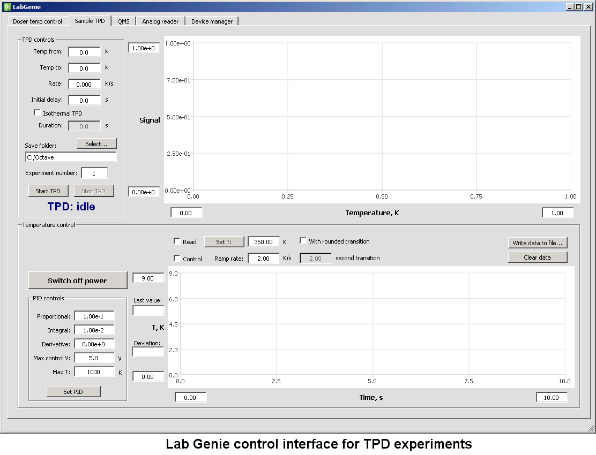

### Lab Genie

Anyone who has worked in a modern lab knows that it's unthinkable without computerized data acquisition and software-enabled controls. However, finding free, user friendly software even for something as simple as PID temperature control can be a challenge. The Lab Genie software, having been developed in a physics and chemistry laboratory, addresses several experimental needs:

* Reading and recording analog voltage signals and temperature
* Running closed-loop PID temperature control
* Controlling Hiden HAL Quadrupole Mass Spectrometers (QMS)
* Running Temperature-Programmed Desorption (TPD) experiments with Hiden HAL QMS

  

While proprietary software certainly exists for all these tasks, it is often quite expensive or tied to expensive hardware products. Freely available software, on the other hand, frequently lacks data plotting or saving capabilities. Lab Genie aims to help fill the resulting niche. It can interface with the following types of hardware devices:

* Phidgets 1048, an affordable 4-channel thermocouple reader from Phidgets.
* Phidgets 1002, a 4-channel analog voltage output from the same company.
* National Instruments NI-9211 4-channel isolated thermocouple reader.
* National Instruments data acquisition (DAQ) boards (for analog voltage input and output).
* Hiden HAL Quadrupole Mass Spectrometer.

### Building from source

To compile Lab Genie locally, clone this repository and open the solution file with Visual Studio 2013 or later. In principle it should be possible to compile it on Unix or MacOS using Qt Creator, as there is no Windows-specific code, but it has not been tried. The project has the following dependencies:

* [Qt5](https://www.qt.io/download) for all the graphical interfaces in the software (LGPL)
* [Qt5Charts](https://doc.qt.io/qt-5/qtcharts-index.html) for plotting capabilities (GPL)
* [Phidgets21 library](https://www.phidgets.com/docs21/OS_-_Windows) for operating Phidgets devices (LGPL)
* If you are compiling with NI hardware support, [NI-DAQmx drivers and library](https://www.ni.com/dataacquisition/nidaqmx.htm) 
* [Pugixml library](https://pugixml.org/) for XML processing (MIT license)
* [C++ Serial library](https://github.com/wjwwood/serial) for serial port communications (MIT license)

Before compilation, include a global define WITH_NI_HARDWARE if you need to interface with NI devices.
